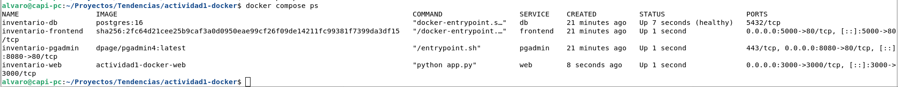
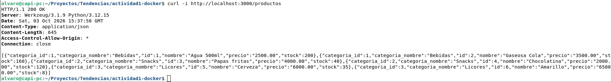
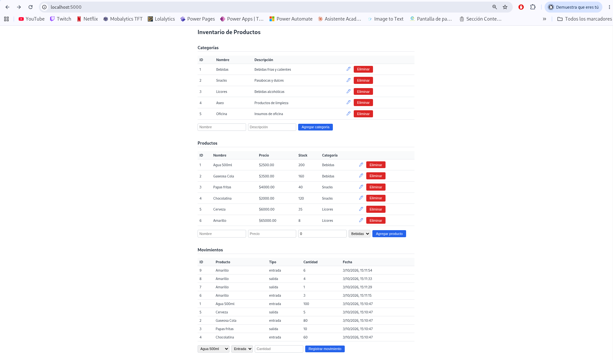
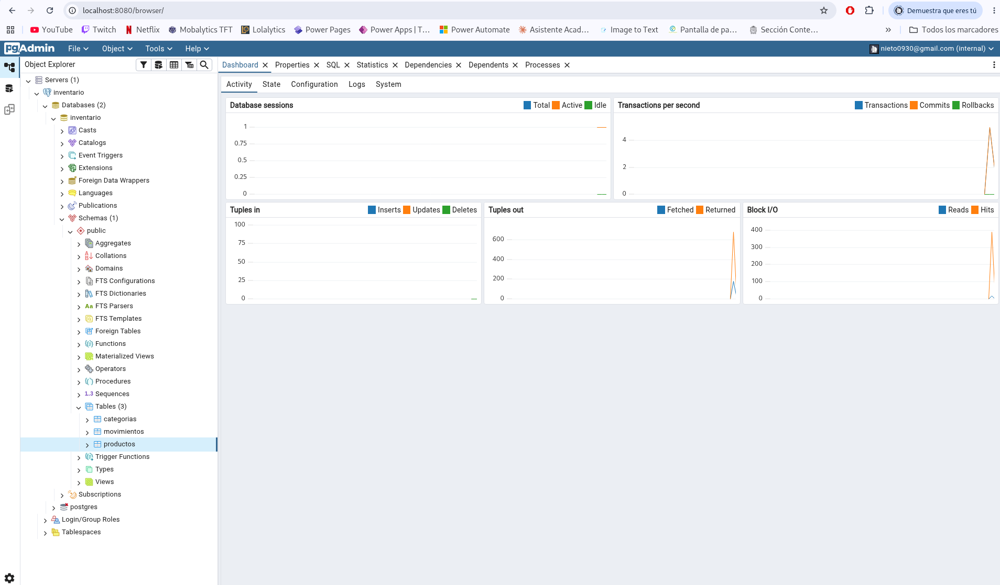

# Inventario de Productos — Orquestación con Docker Compose

Sistema de gestión de inventario con 4 servicios orquestados mediante Docker Compose: base de datos PostgreSQL, API REST en Flask, interfaz de administracion con pgAdmin y frontend servido por Nginx.

Proyecto desarrollado para la actividad **"Orquestacion de servicios con Docker Compose"** - Tendencias en Administracion de Sistemas Informaticos, UNAL Manizales.

## Arquitectura

┌─────────────┐ fetch API ┌─────────────┐
│ frontend │ ─────────────────> │ web │
│ (Nginx) │ │ (Flask) │
│ puerto 5000│ │ puerto 3000│
└─────────────┘ └──────┬──────┘
│
┌──────▼──────┐
┌─────────────┐ │ db │
│ pgadmin │ ─────────────────> │ (PostgreSQL)│
│ puerto 8080│ │ sin puerto │
└─────────────┘ │ al host │
└─────────────┘
Red interna: inventario-net


Todos los servicios se comunican a traves de la red interna **`inventario-net`**, usando el nombre del servicio como hostname (por ejemplo, `web` se conecta a la base de datos usando `db`, no una IP).

## Estructura del proyecto

actividad1-docker/
├── .env # Variables de entorno reales 
├── .env.example # Plantilla de variables de entorno
├── .gitignore
├── docker-compose.yml # El "orquestador": define los 4 servicios (db, web, frontend, pgadmin)
├── app/
│ ├── Dockerfile  # Receta para construir la imagen del servicio "web"
│ ├── app.py # API REST en Flask
│ ├── requirements.txt  # Lista de librerias de Python que necesita app.py
│ └── init-db/
│ └── 01-init.sql # esquema base de datos
└── frontend/
  ├── Dockerfile
  ├── index.html # Estructura de la pagina 
  ├── styles.css # Estilo de la pagina
  └── app.js # Funcionalidad de la pagina

## Requisitos previos

- Docker y Docker Compose instalados (`docker compose version` debe funcionar)

## Instalacion y uso

**1. Clonar el repositorio**

```bash
git clone https://github.com/alvaro309/actividad1-docker.git
cd actividad1-docker
```

**2. Crear el archivo `.env`**

Copia la plantilla y ajusta los valores si lo deseas:

```bash
cp .env.example .env
```

**3. Levantar el stack**

```bash
docker compose up --build
```

La primera vez, Postgres ejecuta automaticamente `app/init-db/01-init.sql`, creando las tablas, el trigger y los datos de ejemplo.

**4. Verificar que todo este corriendo**

```bash
docker compose ps
```

Deberias ver los 4 servicios en estado `Up` (o `running`), y `db` especificamente en `(healthy)`.

## Acceso a los servicios

| Servicio | URL | Credenciales |
|---|---|---|
| Frontend | http://localhost:5000 | — |
| API Flask | http://localhost:3000 | — |
| pgAdmin | http://localhost:8080 | Las definidas en `.env` (`PGADMIN_EMAIL` / `PGADMIN_PASSWORD`) |

**Conectar pgAdmin a la base de datos**, una vez dentro:

1. Clic derecho en **Servers** → **Register → Server**
2. **General → Name:** cualquiera
3. **Connection:**
   - Host: `db`
   - Port: `5432`
   - Maintenance database: el valor de `POSTGRES_DB` en tu `.env`
   - Username: el valor de `POSTGRES_USER`
   - Password: el valor de `POSTGRES_PASSWORD`

## Endpoints de la API

`GET /` lista todos los endpoints disponibles. Resumen:

| Metodo | Ruta | Descripcion |
|---|---|---|
| GET | `/categorias` | Lista todas las categorias |
| POST | `/categorias` | Crea una categoria |
| PUT | `/categorias/<id>` | Edita una categoria |
| DELETE | `/categorias/<id>` | Elimina una categoria |
| GET | `/productos` | Lista todos los productos (con nombre de categoria) |
| POST | `/productos` | Crea un producto |
| PUT | `/productos/<id>` | Edita un producto |
| DELETE | `/productos/<id>` | Elimina un producto |
| GET | `/movimientos` | Lista todos los movimientos |
| POST | `/movimientos` | Registra un movimiento (entrada/salida) |
| PUT | `/movimientos/<id>` | Edita un movimiento |
| DELETE | `/movimientos/<id>` | Elimina un movimiento |

### Nota sobre Movimientos en la interfaz

Los endpoints `PUT` y `DELETE` de `/movimientos` **existen y funcionan** (cumpliendo CRUD completo a nivel de API), pero **no se exponen con botones en el frontend**, por decision de diseño: un movimiento representa un evento historico de inventario, y permitir su edicion/eliminacion libre desde la interfaz romperia la trazabilidad del stock (que se actualiza automaticamente mediante un trigger, ver mas abajo). Pueden probarse directamente con `curl` o Postman.

## Actualizacion automatica de stock

La tabla `movimientos` tiene un **trigger** (`trigger_actualizar_stock`) que se ejecuta despues de cada insercion:

- **Entrada:** suma la cantidad al stock del producto.
- **Salida:** resta la cantidad, pero valida que no se pueda sacar mas de lo disponible. Si se intenta, la base de datos rechaza la operacion con un error, que la API traduce a una respuesta `400` con un mensaje descriptivo.

Ejemplo de validacion (stock insuficiente):

```bash
curl -i -X POST http://localhost:3000/movimientos \
  -H "Content-Type: application/json" \
  -d '{"producto_id": 1, "tipo": "salida", "cantidad": 9999}'
```

## Variables de entorno (`.env`)

| Variable | Descripcion |
|---|---|
| `POSTGRES_DB` | Nombre de la base de datos |
| `POSTGRES_USER` | Usuario de PostgreSQL |
| `POSTGRES_PASSWORD` | Contraseña de PostgreSQL |
| `PGADMIN_EMAIL` | Correo de acceso a pgAdmin |
| `PGADMIN_PASSWORD` | Contraseña de acceso a pgAdmin |

Ninguna credencial esta escrita directamente en el codigo; todas se inyectan por variables de entorno.

## Comandos utiles

```bash
# Ver estado de los servicios
docker compose ps

# Ver logs de un servicio especifico
docker compose logs -f web

# Detener sin eliminar datos
docker compose down

# Reiniciar desde cero (elimina los datos de Postgres)
docker compose down -v
docker compose up --build
```

## Capturas de pantalla

### 1. Servicios corriendo (`docker compose ps`)



### 2. API respondiendo



### 3. Frontend funcionando



### 4. pgAdmin conectado, mostrando las tablas



## Autores

Alvaro Jose Nieto Osorio - Universidad Nacional de Colombia, Sede Manizales
Gabriela Cutiva Carbal - Universidad Nacional de Colombia, Sede Manizales
Wilmer Steeven Acosta Mier - Universidad Nacional de Colombia, Sede Manizales